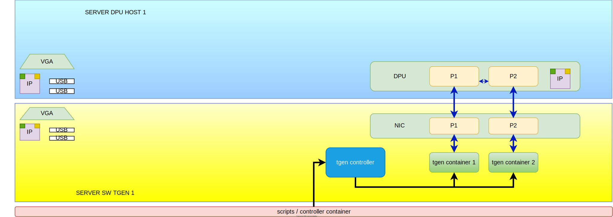
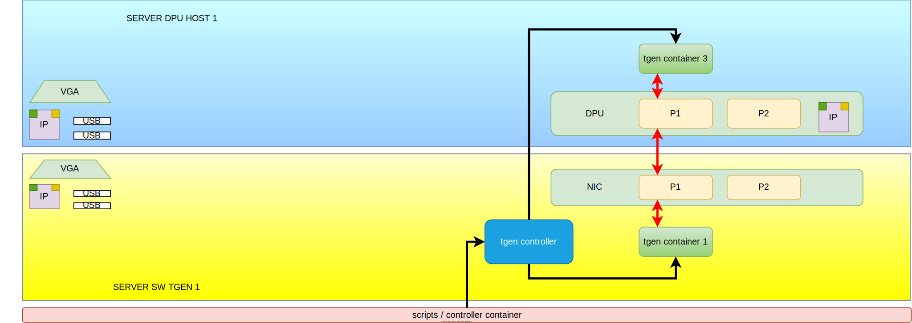
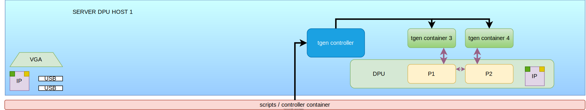
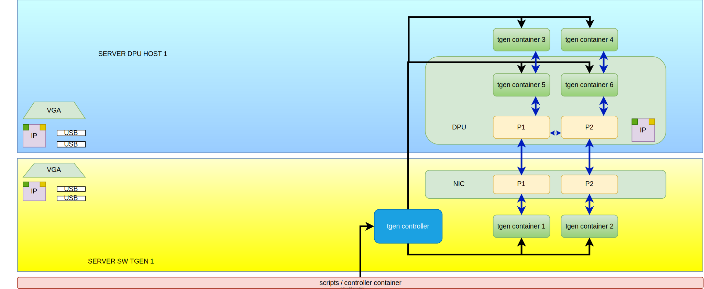

# OPI testing demo/poc

## hardware

- server with Ubuntu 22.04
  - Nvidia BlueField2
- server with Ubuntu 22.04
  - 100G NIC

## topologies

### covered

any combination of host or server traffic originated to any of the 4 ports and targeted to any of the 4 ports (it could come back to itself)


server to dpu, dpu forwording to the other port and back to the server


server to dpu and dpu to the host


host to the dpu, dpu forwording to the other vf port and back to the host


same scenarios as above but having the traffic inside the ipsec tunnel


### not covered

same scenarios as above but having traffic generator endpoints also on the dpu (posible if dpu cores are x86 or arm and docker can be installed)


## testing framework

- to automate the opi cases it is prefered to use [python](https://www.python.org) language
- as test framework it is prefered to use [pytest](https://docs.pytest.org)
- for ssh conectivity it is sugested to use [netmiko](https://github.com/ktbyers/netmiko) package instead of [paramiko](https://www.paramiko.org), it uses paramiko and provides drivers for many devices + ability to write plugins

## traffic generator

Open Traffic Generator (OTG) is an open standard, specifying declarative and vendor neutral API for testing Layer 2-7 network devices and applications (at any scale).

- [open traffic generator website](https://otg.dev)
- [open traffic generator implementation](https://github.com/open-traffic-generator)
- [snappi api library for otg](https://pypi.org/project/snappi)

## to run the test

```Shell

git clone https://github.com/opiproject/opi-poc.git

pip install --no-cache-dir -r ./opi-poc/demos/tgen/requirements.txt

pytest -s ./opi-poc/demos/tgen/test_tgen_demo.py

```

## notes, todo, etc

to debug traffic flow

```Shell
tcpdump -n -e -i enp3s0f1s0
```

setting the way DPU interacts with host requires a reboot

```Shell
mst start
mlxconfig -d /dev/mst/mt41686_pciconf0 s INTERNAL_CPU_MODEL=1
mlxconfig -d /dev/mst/mt41686_pciconf0.1 s INTERNAL_CPU_MODEL=1
```

all paths are absolute paths from my demo testbed, those shoudl be fixed to be more flexible and map the git repo better

```Shell
example: in test_tgen_demo.py
docker compose -f /root/opi/tgen/deployment/tgen.yml up -d
```

there is an assumption the files exist on host or dpu or the server like docker compose files

```Shell
example: in test_tgen_demo.py
docker compose -f /root/opi/tgen/deployment/tgen.yml up -d
```

there is an assumption that docker is installed on the dpu

```Shell
example: in test_tgen_with_ipsec_demo.py
systemctl start docker
docker run --rm --network host --mount src=/var/run,target=/var/run,type=bind --name opi-strongswan-bridge -d ghcr.io/opiproject/opi-strongswan-bridge:main /opi-vici-bridge -port=50151
```

care must be taken to prevent test traffic going out on management interface

pydpu needs to be integrate din ipsec test
