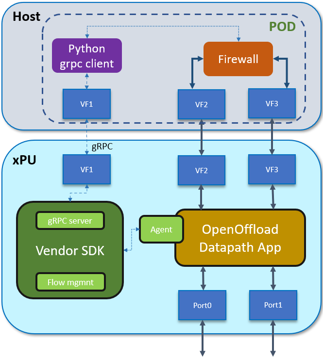

# openoffload PoC

Based on openoffload opensource project, see [openoffload](https://github.com/opiproject/sessionOffload).
Demo offload 5-Tuple UDP and TCP flows to the xPU.

## Description of Demo Steps

1. A packet arrives to xPU
2. The xPU does a lookup in the session table for the session. If the session is present and the action is offload the packet is sent out.
3. If the packet does not exist it is sent to the firewall. The firewall is responsible for managing session state.
4. Packet is sent to the firewall, if the packet is not suitable for offload it is processed by the firewall.
5. If the session is offloadable the session information is sent to the gRPC python client that calls the Vendor with the addSession call to add the session to the xPU session table.
6. The xPU daemon updates the session table and sets a timer for the session (in both directions for TCP flows).
7. Once the timer expires the xPU checks the flows in both directions to see if there have been any packets since the last check. If there have been packets the xPU continues to forward packets. If there have not been any packets the xPU sends an update to the firewall with the packet and byte count of the offloaded packets and removes the session from the session table.
8. The firewall receives the closed session message and updates the session statistics and goes about the session close process.

## GRPC client example

Client code example is located at [client](https://github.com/opiproject/sessionOffload/blob/master/tests/basic/sessions_client.py)

## GRPC server example

Server code example is located at [server](https://github.com/opiproject/sessionOffload/blob/master/tests/basic/sessions_server.py)

## protobuf API

protobuf API is located at [protobuf](https://github.com/opiproject/sessionOffload/blob/master/protos/openoffload.proto)

## PoC execution

For python PoC execution please follow [example](https://github.com/opiproject/sessionOffload/blob/master/tests/pythonSimulator/README.md)

## Generic SmartNIC Architecture

[Architecture](https://github.com/opiproject/sessionOffload/blob/master/doc/SmartNIC_Arch.md)

## High level architecture with xPU

## Openoffload Demo with Marvell OCTEON xPU

Demo presented during OPI API meeting(22/8/2022)
